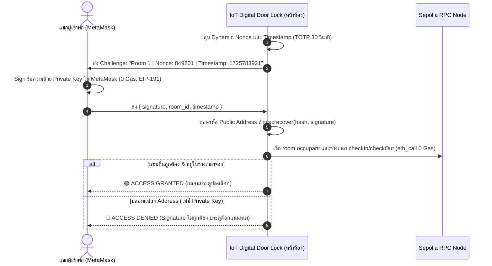

# 🏨 PremiumHotel v3 — Decentralized Hotel Reservation Web App

A production-grade Web3 Hotel Reservation DApp built on **Ethereum Sepolia Testnet** with **Next.js 14**, **Tailwind CSS**, and **Ethers.js v6**.

---

## 🎓 Teacher Feedback & Architectural Solutions (เอกสารประกอบการประเมิน)

### 1. ระบบวันและเวลาในการจอง (Check-in & Check-out Date/Time)
* **ปัญหาเดิม:** สัญญาเดิมบันทึกเพียงสถานะการจองทันที (`bookingTime = block.timestamp`) โดยไม่มีการระบุช่วงวันและเวลาเข้าพัก
* **การแก้ปัญหาใน v3:**
  - เพิ่ม `checkInTime` และ `checkOutTime` (Unix Timestamps) ใน `struct Room`
  - คำนวณราคาอัตโนมัติตามระยะเวลาเข้าพัก:  
    $$\text{nights} = \left\lceil \frac{\text{checkOutTime} - \text{checkInTime}}{86400} \right\rceil$$
    $$\text{totalPrice} = \text{nights} \times \text{pricePerNight}$$
  - **ระบบชำระเงิน 2 ขั้นตอน:** มัดจำ 50% ตอนกดจอง และจ่ายอีก 50% ก่อนเข้าพัก
  - **การรับประกันการยกเลิก 24 ชม.:** หากยกเลิกภายใน 24 ชั่วโมงหลังจากเวลาที่ทำรายการจอง Smart Contract จะโอนเงินมัดจำ 50% คืนให้ทันที
  - **ระบบ Self Check-Out & Auto-Expiry:** ผู้เข้าพักสามารถกดคืนห้อง (Check-out) ได้ด้วยตนเอง หรือเมื่อพ้นเวลา `checkOutTime` แล้ว บุคคลใดก็ได้สามารถกด `expireBooking()` เพื่อปลดปล่อยห้องให้กลับมาว่าง (Available) สำหรับแขกท่านถัดไป

---

### 2. การวิเคราะห์ค่า Gas ในการอ่าน/เช็คข้อมูล (Gas Cost Analysis for Queries)
> **คำถามอาจารย์:** *"ฟังก์ชันที่เช็คข้อมูลใน blockchain มีการเสียค่า Gas หรือไม่? ถ้าข้อมูลเยอะมากจะทำให้ฟรีไหม หรือใช้ฟังก์ชันเยอะขึ้น?"*

#### ก. การอ่านข้อมูลผ่าน `view` / `pure` เสียค่า Gas หรือไม่?
* **ตอบ: ฟรี 100% (0 Gas)** สำหรับผู้เรียกจากภายนอก (Off-chain Client)
* **เหตุผลทางเทคนิค:** เมื่อ Web Frontend เรียกฟังก์ชันอย่าง `getAllRooms()`, `getRoomDetails()`, หรือ `owner()` คำสั่งจะถูกส่งผ่าน RPC Node ในรูปแบบ **`eth_call`** โหนดจะรันโค้ด Bytecode ในเครื่องของตนเองแบบ Read-Only Memory **โดยไม่ต้องสร้าง Transaction, ไม่ต้อง Sign, ไม่ต้อง Broadcast ไปยังเครือข่าย และไม่ต้องขุดลงบล็อก** จึงไม่มีค่าธรรมเนียม Gas
* **ข้อยกเว้น:** หากฟังก์ชัน `view` ถูกเรียก **ภายใน Transaction ที่มีการแก้ไขข้อมูล (Write Tx)** เช่น ฟังก์ชัน `bookRoom()` ไปเรียกคำนวณภายใน การประมวลผลนั้นจะต้องเสียค่า Gas รวมใน Transaction นั้น

#### ข. ถ้าข้อมูลมีปริมาณมหาศาล (Big Data) จะเกิดอะไรขึ้น?
* แม้ว่า `eth_call` จะไม่คิดค่า Ether แต่โหนด RPC มีข้อจำกัดทางกายภาพคือ **Gas Limit ต่อการ Call (ปกติ 50M gas)** และ **Execution Timeout (10–30 วินาที)**
* หากเราเขียน Smart Contract ที่วน Loop ดึงข้อมูลห้อง 10,000 ห้องพร้อมกัน การเรียก `eth_call` จะล้มเหลวด้วยข้อผิดพลาด *Out of Gas* หรือ *RPC Timeout*
* **แนวทาง Optimization ในโปรดักชัน:**
  1. **Event Indexing (The Graph / Subsquid):** เปลี่ยนจากการ Query บน Storage ตรงๆ มาเป็นการปล่อย Event (`event RoomBooked(...)`) แล้วนำข้อมูลไป Index ลงฐานข้อมูลภายนอก (GraphQL) ซึ่งค้นหาได้ไม่จำกัดและเร็วกว่า 100 เท่าแบบฟรี
  2. **IPFS Metadata Off-chaining:** เก็บข้อมูลขนาดใหญ่ เช่น รูปภาพ รายละเอียดสิ่งอำนวยความสะดวก ไว้บน IPFS/Arweave แล้วเก็บบน Blockchain เพียง Hash หรือ ID สั้นๆ
  3. **Pagination:** ใช้ฟังก์ชันแบ่งหน้า `getRooms(uint256 offset, uint256 limit)` แทนการดึง Array ทั้งหมดในครั้งเดียว

#### ค. ตารางเปรียบเทียบ Gas การทำงานแต่ละประเภท

| ประเภทการทำงาน | ฟังก์ชันในระบบ | ค่า Gas โดยประมาณ | เสียค่า Ether จริงไหม? | บันทึกลง Blockchain? |
| :--- | :--- | :--- | :--- | :--- |
| **Read (Off-Chain)** | `getAllRooms()` | 0 Gas | ❌ **ฟรี (0 ETH)** | ❌ ไม่บันทึก |
| **Cryptographic Sign** | `signDoorChallenge()` | 0 Gas | ❌ **ฟรี (0 ETH)** | ❌ ไม่บันทึก |
| **Write (Storage)** | `bookRoom(...)` | ~120,000 Gas | ✅ เสียค่า Gas | ✅ บันทึก |
| **Write (Payment)** | `payRemaining(...)` | ~48,000 Gas | ✅ เสียค่า Gas | ✅ บันทึก |
| **Write (Self Checkout)** | `checkoutRoom(...)` | ~38,000 Gas | ✅ เสียค่า Gas | ✅ บันทึก |

---

### 3. ระบบ Digital Door Lock และการป้องกันการปลอมแปลง Address (Anti-Spoofing Security)
> **คำถามอาจารย์:** *"ถ้ามีข้อมูลใน blockchain แล้ว มีดิจิตอลดอลอคแล้ว เข้าประตูได้เลย เพราะมี address แล้วสมมติว่ามีคนอื่นรู้ address เรา ก็สามารถเข้าได้ ดังนั้นเราจะทำอย่างไรดี?"*

#### ก. ช่องโหว่ของการใช้ Public Address ตรงๆ
* บนเครือข่าย Ethereum ข้อมูล **Public Address และประวัติการจองเป็นข้อมูลสาธารณะ (Public Data)** ที่ทุกคนเปิดดูได้บน Etherscan
* หากกลอนประตูดิจิทัล (IoT Lock) ตรวจสอบเพียงว่า:
  $$\text{Scanned Address} == \text{room.occupant}$$
  ผู้ไม่ประสงค์ดีสามารถคัดลอก Public Address ของผู้เข้าพักไปใส่ใน QR Code หรือบัตร RFID ปลอมเพื่อเปิดห้องพักได้ทันที!

#### ข. แนวทางแก้ไข: การพิสูจน์สิทธิ์ด้วย Cryptographic Challenge-Response (TOTP + EIP-191)
ระบบของเราแก้ปัญหานี้ด้วยการใช้ **ลายเซ็นดิจิทัล (Digital Signature)** ที่ต้องใช้ **Private Key** ของผู้เข้าพักเท่านั้นในการสร้างลายเซ็น โดยไม่มีค่าธรรมเนียม Gas:



* **ผลลัพธ์:** แม้ผู้ไม่ประสงค์ดีจะรู้ Public Address ของผู้เข้าพัก แต่จะ**ไม่สามารถปลดล็อกประตูได้** เนื่องจากไม่มี Private Key ในการสร้างลายเซ็นดิจิทัลให้ตรงกับ Challenge ประจำช่วงเวลา (30 วินาที) นั้นๆ
* **UI Interactive Simulator:** ในหน้าเว็บมีระบบจำลอง **"IoT Smart Door Lock Simulator"** ซึ่งมีปุ่มให้ทดลองจำลองการโจมตีแบบ Address Spoof Attack เพื่อสาธิตให้อาจารย์เห็นอย่างชัดเจน

---

## 🚀 Smart Contract Details (Sepolia Testnet)

* **Contract Version:** PremiumHotel v3
* **Contract Address:** [`0x8Ed901d11056faFA8C728FE93E2a0d8884Ec0f02`](https://sepolia.etherscan.io/address/0x8Ed901d11056faFA8C728FE93E2a0d8884Ec0f02)
* **Contract Owner:** `0x7c4DC760Ef3fD601852929b758E566E3FcB89e6a`
* **Network:** Ethereum Sepolia (Chain ID: `11155111`)

---

## 🛠️ Local Development & Deployment

### 1. ติดตั้ง Dependencies
```bash
npm install
```

### 2. คอมไพล์ Smart Contract
```bash
npm run compile
```

### 3. Deploy ขึ้น Sepolia Testnet
```bash
npm run deploy:sepolia
```

### 4. รัน Web Application ในเครื่อง
```bash
npm run dev
```
เปิดบราวเซอร์ที่ [http://localhost:3000](http://localhost:3000)
